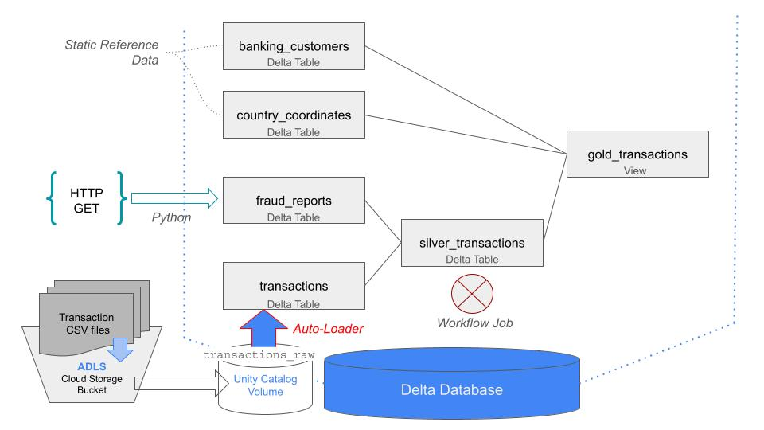
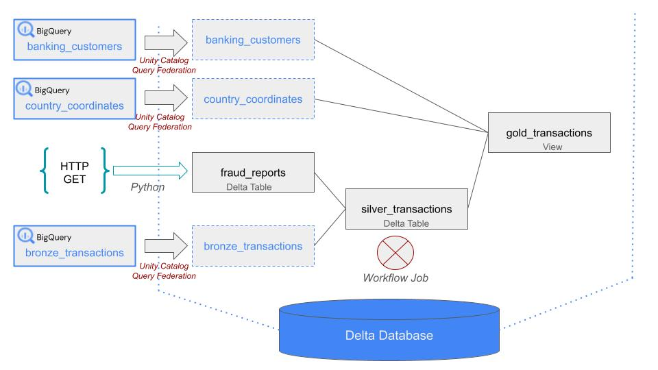
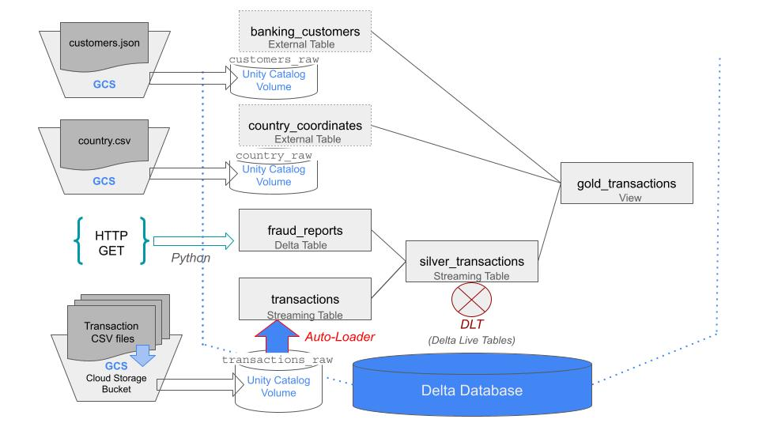
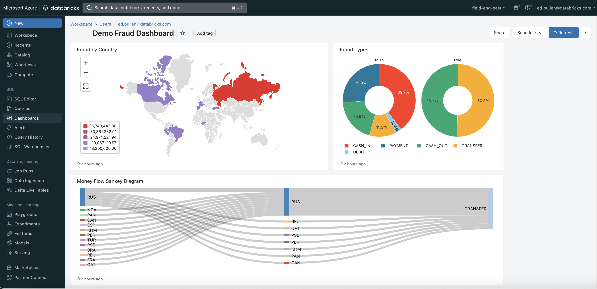

# Databricks Demo with Retail Bank Fraud Data

## Pipeline overview ##  
### V1: Azure ADLS and Unity Catalog Volumes
+ Ingest files from Azure ADLS storage container - table `transactions`
  + A Unity Volume needs to be set up in advance which references the location where the files will be staged. See `./notebooks/setup_volume_adls.py` for an example.
  + Copy the `./data/transactions/*.csv` files in the ADLS storage bucket linked to the Unity Volume ref.
  + The Azure ADLS bucket can be replaced with AWS s3 or GCP GCS bucket and the same approach followed.
+ Ingest data from REST API - table `fraud_reports`
+ Join Transactions and Fraud data in Databricks to create table `silver_transactions`
+ Databricks Delta tables `banking_customers` and `country_coordinates` are joined with `silver_transactions` to produce table `gold_transactions`

     


### V2: Google Big Query and Unity Catalog Federation

   


### V3: Google GCS and Unity Catalog Volumes + Big Query Federation + DLT

   

#### Setup Steps

Pre: Clone the git repo in the Workspace.

1. Stage the `banking_customers` and `country_coordinates` data in separate folders in a GCS bucket.
2. Prepare a GCS bucket and folder for loading the `transactions` data into - call this folder `transactions`.
3. Create three Unity Catalog Volumes to load the three different data-sets from: `transactions_raw`, `country_coordinates`, `banking_customers`
   + Follow the guide in `./notebooks/setup_volume_gcs` to do this.   
4. Setup the `fraud_reports` table: `notebooks/setup_fraud_reports`
5. Use the notebook `./notebooks/setup_reference_data_ext` to set up some external tables mapped to the external volume locations.
6. Create a DLT pipeline, following the instructions in **TBC** and using `notebooks/setup_silver_transactions_pipeline_DLT.sql` as the pipeline Source code. 
7. Create the gold view using `./notebooks/setup_gold_transactions_view`


Template GCS or S3 bucket structure:
```
<my_bucket>/bronze_transactions
<my_bucket>/banking_customers
<my_bucket>/country_coordinates
```

## ETL Code and Sample Data

### Example ETL Code

Three different types of simple ETL load / transform operations are provided in `./etl/data_load.py`:
+ streaming in updates from files staged in cloud storage in the `auto_loader()` function.
+ custom code to pull data from a web URL in the `web_url_pull()` function
+ SQL wrapped in PySpark for merge+join operations on Delta table-data in the `load_silver_transactions()` function

In addition, an example using *DLT* ([Delta Live Tables](https://docs.databricks.com/en/delta-live-tables/index.html)) is provided
+ A DLT notebook is located in `./notebooks/setup_silver_transactions_pipeline_DLT`

### Example SQL Code
Example queries are in the `./sql` folder:
+ `amount_by_country.sql` 
+ `amount_over_time.sql`  
These can be used to underpin dashboard visualizations or reporting. 

### Sample Data

Sample data for running the pipeline is in `./data/`

+ `./data/country_coordinates/*` - static data; just manually load the CSV into a delta table.
+ `./data/customers/*` - static data; just manually load the CSV into a delta table.
+ `./data/fraud_reports/*` - `./etl/data_load.web_url_pull()` pulls data directly from here and stages in the `fraud_reports` table.
+ `./data/transactions/*` - use these g-zipped CSV files to load into ADLS (or an S3 / GCS bucket) and simulate streaming files into the pipeline.

## Job Configuration

Use the two notebooks 
+ `./jobs/run_transaction_file_load.py`
+ `./jobs/run_silver_table_load.py`

to call the ETL code in `./etl` and run the ETL pipeline.  These read the parameters configured in the Databricks Job run-time configuration and pass them to the code execution.

**Alternatively**
Use DLT
+ `./notebooks/setup_silver_transactions_pipeline_DLT.sql`

## Development Environment

Databricks DB-Connect V2 allows IDE development, Git integration and Unit Tests

See function `sdk_connect_config()` in `./etl/common.py` for how this is set up.  
`main.py` shows an example of how this can be used to run the ETL code against a remote test cluster and data-set from code in the local Dev IDE environment.

## System Environment

Developed against Databricks `LTS 13.3 ML` cluster

Local Env: Python `3.10.12`

Python Libraries: `requirements.txt`   (note DB-Connect version aligns with Databricks cluster version )

## Analytics

Create the `gold_transactions` view using notebook `./notebooks/setup_gold_transactions_view.py`  

The view can be used for doing analytics, building dashboards or training ML models.  

     

