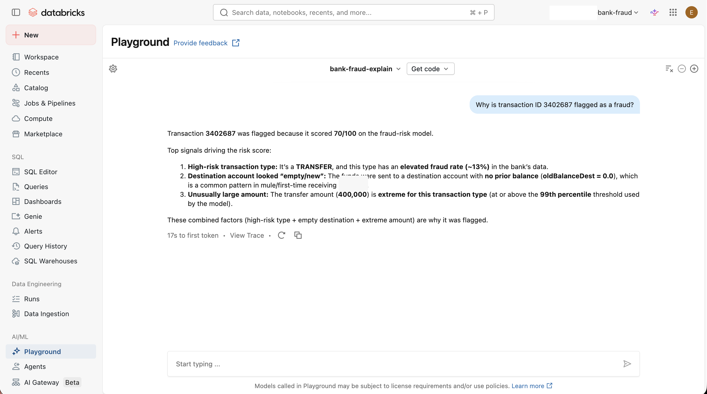

# Databricks Demo with Retail Bank Fraud Data

Ingest multiple data-sources and join them to analyze simulated bank fraud transactions and build a machine learning model to predict fraud.

The dataset is based on the [PaySim](https://www.msc-les.org/proceedings/emss/2016/EMSS2016_249.pdf),  dataset (GitHub [repo](https://github.com/EdgarLopezPhD/PaySim) and [LICENSE](https://github.com/EdgarLopezPhD/PaySim/blob/master/LICENSE) for more details). The Databricks demo version augmented this dataset to introduce simulated geo-data as well.  The Databricks version of this data has a [LICENCE](https://github.com/databricks-demos/dbdemos-dataset/blob/main/LICENSE) for use.


## Data Schema

Files are staged in Unity Catalog volumes and then ingested into Delta Tables.  

 

# IDE Connect to the workspace environment

Most steps described can be executed from a local IDE running with a local clone of this Git repo.   Use the Databricks SDK and CLI to authenticate to a remote workspace and it's services.

The Databricks CLI profiles are configured in `~/.databrickscfg`.  

- Check the available CLI profiles to connect to: `databricks auth profiles`
- Authenticate to a configured profile using [U2M OAuth](https://docs.databricks.com/aws/en/dev-tools/cli/authentication#oauth-user-to-machine-u2m-authentication): `databricks auth login -p my_profile_name`.

*Either* 

- set the DEFAULT profile to work in with the Databricks CLI by editing `~/.databrickscfg` and setting the profile name in the `[DEFAULT]` section  
*Or*  
- Add the -p `<my_profile_name>` to the end of all Databricks CLI commands.  
in order  to make sure they get executed against the correct workspace.

# Quick-start deployment
## 1. Raw Data, Volumes, Tables and Views

- Identify / Create the Unity Catalog (UC) Catalog
- Identify / Create the UC Schema
- Create the Volume `bank-fraud` in the UC catalog.schema

Use the `create.sh` and `destroy.sh` scripts to deploy or tear down the demo from the repo root. They support both **non-interactive** (one-shot, suitable for CI or AI agents) and **interactive** (step-by-step prompts) modes.

**Non-interactive (all parameters on the command line):**

```bash
./create.sh --non-interactive --profile myprofile --catalog main --schema default --volume bank-fraud
# ... later, to tear down:
./destroy.sh --non-interactive --profile myprofile --catalog main --schema default --volume bank-fraud
```

**Interactive (prompted for profile, catalog, schema, volume):**

```bash
./create.sh
# or with partial args:
./create.sh --catalog main --schema default
```

**Optional:** sync notebooks to the workspace and create the UC volume if it does not exist:

```bash
./create.sh -y -p myprofile -c main -s default -v bank-fraud --workspace-path /Users/me@example.com/dbx-bank-fraud --create-volume
```

For full options run:

- `./create.sh --help`
- `./destroy.sh --help`

## 2. Deploy Notebooks, ML Model, Serving Endpoint and Dashboard

After the base data and tables are in place (e.g. via `create.sh`), use `deploy.sh` to deploy and **build** the ML artefacts and the Retail Bank Fraud dashboard:

1. **Notebooks** — Imports `fraud_model_training.py`, `fraud_model_deploy.py`, and `fraud_model_run.py` from `./notebooks` into your workspace.
2. **ML build** — Runs the training notebook then the deploy notebook (so the model is registered in Unity Catalog). By default uses **serverless compute** (no cluster ID needed). Optionally pass `--cluster-id` to use an existing cluster. If a notebook run fails, the script prints the run ID and fetches the run output; you can also run `databricks -p <profile> jobs get-run-output <run_id>` to view error details.
3. **Dashboard** — Creates and publishes the Lakeview dashboard from `dashboards/Retail_Bank_Fraud_Dashboard.lvdash.json`, with your catalog and schema applied to the datasets.

NOTE: make sure a folder structure is in place in the workspace for the notebooks to be copied to. This needs to include a pre-created `notebooks` folder, i.e. pre-create `/Users/me@example.com/dbx-bank-fraud/notebooks`

**Example (serverless; no cluster):**

```bash
./deploy.sh -p myprofile -c my_catalog -s my_schema --workspace-path /Users/me@example.com/dbx-bank-fraud --warehouse-id <sql-warehouse-id>  --serve-model
```

**Example (with existing cluster):**

```bash
./deploy.sh -p myprofile -c my_catalog -s my_schema --workspace-path /Users/me@example.com/dbx-bank-fraud --warehouse-id <id> --cluster-id <cluster-id>
```

**Example (non-interactive, serverless):**

```bash
./deploy.sh -y -p myprofile -c my_catalog -s my_schema --workspace-path /Users/me@example.com/dbx-bank-fraud --warehouse-id <id>
```

**Example (with model serving endpoint):**

```bash
./deploy.sh -y -p myprofile -c my_catalog -s my_schema --workspace-path /Users/me@example.com/dbx-bank-fraud --warehouse-id <id> --serve-model
```

**Example (serve-model only; no workspace-path or warehouse-id):**

```bash
./deploy.sh -y -p myprofile -c my_catalog -s my_schema --skip-notebooks --skip-ml --serve-model
```

Example - Use the Databricks CLI to flag a model version `production` then serve that version

```
# Set the production alias on a model version
databricks -p myprofile registered-models set-alias <catalog>.<schema>.bank_fraud_predict production <version_num>
# Deploy "bank-fraud-predict" serving endpoint on bank_fraud_predict@production
./deploy.sh -y -p myprofile -c my_catalog -s my_schema --skip-notebooks --skip-ml --serve-model

```

**Options:**  

- `--skip-ml` — do not run training or deploy notebooks.  
- `--skip-dashboard` — do not create the dashboard.  
- `--skip-notebooks` — do not import notebooks (e.g. dashboard-only or serve-model-only).  
- `--genie` — create a Genie space for `gold_transactions` (warehouse ID required when using `--genie`).  
- `--cluster-id` — optional; omit for serverless.  
- For deploy types that only create the dashboard or `--serve-model` fraud endpoint, use `--skip-notebooks --skip-ml`; then `--workspace-path` and (for serve-model-only) `--warehouse-id` are not required. **`--deploy-agent` always needs `--workspace-path`.**

**Model serving** (when using `--serve-model`):  

- **Endpoint name:** `--endpoint-name` (default `bank-fraud-predict`) is the name of the serving endpoint in the workspace.  
- **Model name:** `--model-name` (default `bank_fraud_predict`) is the Unity Catalog model name; full name is `catalog.schema.model_name`.  
- **Version:** Omit `--model-version` to use the version with alias `production`, or if none, the latest version.

Run `./deploy.sh --help` for all options.  

**Undeploy:** Run `undeploy.sh` to trash the dashboard, any Genie space, and the model serving endpoint created by deploy (and optionally remove the workspace path with `--remove-workspace`). It does not unregister ML models or delete experiments.

```bash
./undeploy.sh -p myprofile
./undeploy.sh -p myprofile --remove-workspace
```

The dashboard template lives in `dashboards/Retail_Bank_Fraud_Dashboard.lvdash.json`; a copy remains in `sql/` for reference.

#### Testing the Model Serving Endpoint.

Rest API JSON Payload - predicts 1 (Fraud)

```
{
  "dataframe_records": [
    {
      "countryOrig_name": "Turkey",
      "diffDest": 400000,
      "diffOrig": -400000,
      "oldBalanceDest": 0,
      "amount": 400000,
      "type": "TRANSFER",
      "newBalanceDest": 400000,
      "countryDest_name": "Canada"
    }
  ]
}
```
Rest API JSON Payload - predicts 0 ( Not Fraud)

```
{
  "dataframe_records": [
    {
      "countryOrig_name": "Russian Federation",
      "diffDest": 0,
      "diffOrig": 358291.03,
      "oldBalanceDest": 1278730.92,
      "amount": 358291.03,
      "type": "CASH_IN",
      "newBalanceDest": 1278730.92,
      "countryDest_name": "Russian Federation"
    }
  ]
}
```

## 3. Deploy UC Function + AI Chat Agent using UC Function tool

+ Create two UC functions: `explain_transaction_risk()` (historical, reads
  `gold_transactions`) and `explain_live_transaction_risk()` (live, reads
  `live_transactions` with CDC dedup; baselines from `gold_transactions`).
+ Register the UC model **`fraud_model_explain`** (LangChain + `ChatDatabricks` +
  foundation LLM) — one agent, both functions registered as tools.
+ Serve it as a model serving endpoint (default name via deploy: **`bank-fraud-explain`** — hyphens; UC model uses underscores)

The agent picks which tool to call from the conversation:

- Explicit tag: `"Why does live txn 10003599 look risky?"` or `"... historical txn 620650 ..."`.
- Session context: open the chat with `"We are working off live transactions for this session."` then ask bare ids.
- If unspecified, the agent defaults to **live** and tells you which dataset it queried.

See [Live agent and dual-tool routing](#live-agent-and-dual-tool-routing) below for the schema migration and prompt-pattern details.

**Automated run** (assumes agent notebooks are already in the workspace, or omit `--skip-notebooks` to import everything first):

```bash
./deploy.sh -y -p myprofile -c my_catalog -s my_schema \
  --workspace-path /Users/you@example.com/dbx-bank-fraud \
  --skip-notebooks --skip-ml --skip-dashboard \
  --deploy-agent
```

** NOTE ** allow up to 20 minutes after the register and deploy agent has completed.  It takes a while for the serving endpoint to come on-line.   

Optional: `--llm-endpoint <name>` (default `databricks-gpt-5-2`), `--agent-serving-endpoint-name <name>` (default `bank-fraud-explain`), `--agent-register-timeout <seconds>` (default `5400` for the register/deploy notebook). Uses serverless compute unless you pass `--cluster-id`.

Test the agent to explain Fraud using the AI Playground.  Try transaction ID 3402687 as an example.




## 4. Databricks Apps Serving - deploy transaction simulator and web-app to App

Pre-reqs:
1. Lakebase Database: create a lakebase database in the workspace. Note the endpoint hostname and endpoint details (use the Lakebase "Connect" dialog to find the details required for connecting)
  Also use `databricks postgres list-projects -p <my-dbx-cli-profile>` to get the project ID


#### Smoke tests for Lakebase 
Check the Lakebase services are there and connectivity is set up correctly in `/app/.env`
- `python scripts/lakebase_smoke_test.py`

#### Deployment Steps - Databricks CLI

1. Ensure frontend is built:
```
cd <repo-dir>/app/frontend && npm run build 
```

2. Create the app (first time only):
```
databricks apps create fraud-analytics --profile <my-profile>
```

3. Sync app files to workspace:
```
databricks sync <repo-dir>/app /Workspace/Users/<user.name>@databricks.com/fraud-analytics --profile <my-profile>
```

4. Upload the built frontend separately (since .gitignore excludes dist/):
```
databricks workspace import-dir <repo-dir>/app/frontend/dist /Workspace/Users/<user.name>@databricks.com/fraud-analytics/frontend/dist --profile <my-profile> --overwrite
```

5. Deploy

Note that the `app/app.yaml` configuration binds the app to the Lakebase DB.  Check that this links up with the target lakebase DB.
```
databricks apps deploy fraud-analytics --source-code-path /Workspace/Users/<user.name>@databricks.com/fraud-analytics --profile <my-profile>
```

6. Check status and get the app URL:
```
databricks apps get fraud-analytics --profile <my-profile>
```

7. Get the Service Principal Name for the app:
```
databricks apps get fraud-analytics --profile <my-profile> |grep service_principal
```
(Alternatively Compute → Apps → <app> → identity in the Workspace UI)

8. Grant permissions for the App Service Principal to Query the `bank-fraud-predict` endpoint
Databricks Workspace UI -> Serving -> Permissions -> Add <service_principal_client_id> with "Can Query" privs

9. Restart the app (Re-Deploy)

10. Subsequent changes to code:
Updates after code change - after changing backend/frontend, repeat build → sync → import-dir dist → deploy (or at least sync + dist when only UI changes).

#### Post-deploy Lakebase bootstrapping

Declaring `resources:` in `app/app.yaml` is **not enough** on its own to make
the deployed app talk to Lakebase. The Databricks Apps platform only injects
`PGHOST / PGPORT / PGDATABASE / PGUSER` (and sometimes `PGPASSWORD`) once the
resource is **bound to the app in the UI**, and the app's **service principal**
(SP) still has to be granted Postgres-level privileges separately from any
Databricks-level ACLs.

Work through this checklist the first time you deploy to a new workspace. The
same steps apply after restoring or recreating the Lakebase instance.

1. **Bind the Lakebase + Serving resources in the App UI.**
   Compute → Apps → `fraud-analytics` → **Settings → Resources → Add resource**:

   - **Database (Lakebase)**
     - Resource key: `lakebase-db` ← must match the `name:` in `app.yaml`
     - Database instance: your Lakebase instance
     - Database name: `databricks_postgres`
     - Permission: **Read and write**
   - **Serving endpoint**
     - Resource key: `fraud-model`
     - Endpoint: `bank-fraud-predict`
     - Permission: **Can query**

   After saving, the app restarts and the **Environment** tab should show
   `PGHOST`, `PGPORT`, `PGDATABASE`, `PGUSER`. If these never appear, the
   binding did not take — fix that before anything else.

2. **Set `LAKEBASE_ENDPOINT`.** The platform injects host/user/db but not
   necessarily `PGPASSWORD`. The app falls back to OAuth token generation via
   the Databricks SDK, which needs the Lakebase endpoint path. It is already
   declared in `app/app.yaml`:

   ```yaml
   env:
     - name: LAKEBASE_ENDPOINT
       value: "projects/<project>/branches/<branch>/endpoints/<endpoint>"
   ```

   Update the value to match your workspace, or set it via the Environment tab.

3. **Pin a recent `databricks-sdk`.** Lakebase OAuth uses
   `WorkspaceClient.postgres.generate_database_credential(...)`, which only
   exists in recent SDK releases. `app/requirements.txt` pins
   `databricks-sdk>=0.96`; keep that, or bump it.

4. **Grant Postgres privileges to the app SP.** "Can manage" on the Lakebase
   instance is a *Databricks-level* ACL — Postgres inside the database needs
   its own grants. Connect as your own user (the smoke test or `psql` with an
   OAuth token will do) and run:

   ```sql
   -- Replace with the SP UUID from PGUSER (also = DATABRICKS_CLIENT_ID in the
   -- app Environment tab). Keep the double quotes.
   GRANT USAGE, CREATE ON SCHEMA public TO "<APP_SP_UUID>";
   GRANT SELECT, INSERT, UPDATE, DELETE ON scored_transactions TO "<APP_SP_UUID>";
   ALTER DEFAULT PRIVILEGES IN SCHEMA public
     GRANT SELECT, INSERT, UPDATE, DELETE ON TABLES TO "<APP_SP_UUID>";
   ```

5. **Make the app SP own its own table** (first deploy, or when reusing an
   existing Lakebase that already contains `scored_transactions`).

   The app's startup runs `CREATE TABLE IF NOT EXISTS` *and*
   `CREATE INDEX IF NOT EXISTS`. Postgres enforces table ownership on the
   index DDL even when the indexes already exist, so if your user created the
   table earlier (e.g. during local dev) the deployed app will fail with
   `must be owner of table scored_transactions`.

   The cleanest fix is to drop the table and let the SP recreate it on
   startup. The rows are already replicated to Delta via Lakehouse Sync, so
   there is no real data loss for the demo:

   ```sql
   DROP TABLE IF EXISTS scored_transactions CASCADE;
   ```

   Restart the app. It creates the table, becomes the owner, and subsequent
   restarts are idempotent.

   If you need to preserve the Lakebase rows, back them up first, let the SP
   recreate the table, then reload:

   ```sql
   CREATE TABLE scored_transactions_backup AS SELECT * FROM scored_transactions;
   DROP TABLE scored_transactions CASCADE;
   -- restart the app so the SP creates the new table
   INSERT INTO scored_transactions SELECT * FROM scored_transactions_backup;
   DROP TABLE scored_transactions_backup;
   ```

   (Transferring ownership via `ALTER TABLE ... OWNER TO "<APP_SP_UUID>"`
   usually fails in Lakebase with `must be able to SET ROLE` because your user
   is not automatically a member of the auto-provisioned SP role — drop and
   recreate is less ceremony.)

6. **Lakehouse Sync (Lakebase → Delta) replica identity.**
   Lakebase's Delta Lakehouse Sync is Postgres logical replication under the
   hood. It **skips any table whose `REPLICA IDENTITY` is not `FULL`** and
   shows it as `Skipped` in the *Start sync* dialog with the notice
   *"Run `ALTER TABLE ... REPLICA IDENTITY FULL` to include them."*

   The app's `ensure_tables()` (see `app/backend/db.py`) now issues
   `ALTER TABLE scored_transactions REPLICA IDENTITY FULL;` as part of its
   startup DDL, so every fresh drop/recreate cycle sets this automatically.
   Verify from your laptop with:

   ```sql
   SELECT relname, relreplident
   FROM pg_class
   WHERE relname = 'scored_transactions';
   -- relreplident = 'f'  → FULL (what we want)
   -- relreplident = 'd'  → DEFAULT (sync will skip it)
   ```

   If a sync was active before you dropped the Lakebase table, click
   **Disable sync** first in the Lakebase Branch overview to clear stale
   config, then **Start sync** again. The other tables the dialog lists as
   `Existing` (e.g. `bronze_transactions`, `banking_customers`) are unrelated
   UC tables living in the target schema — Lakehouse Sync will leave them
   alone.

7. **Verify.** Restart the app and check `/logz`:

   - `OAuth token generated, expires at ...`
   - **no** `Using in-memory MockDB` line
   - bridge inserts appearing as transactions score

   You can also run `python scripts/lakebase_smoke_test.py` from your laptop
   to confirm the table is present and growing.

#### Troubleshooting queries

A few canned SQL snippets for debugging the deployed app. Run them connected
to Lakebase as your user (the smoke test / `psql` with an OAuth token both
work). All timestamp columns are `TIMESTAMPTZ` and are **stored in UTC**;
values in `/logz` are shown in your local timezone (e.g. BST), so expect a
timezone offset between the two views.

**Is the pipeline alive right now?** Run this, start streaming for 20 s, run
it again. Row count and `max_id` should advance; `age_of_newest_row` should
shrink to < a minute.

```sql
SELECT
  COUNT(*)                            AS total_rows,
  MIN(id)                             AS min_id,
  MAX(id)                             AS max_id,
    MIN(from_utc_timestamp(scored_at, 'UTC')) AS first_scored_utc,
  MAX(from_utc_timestamp(scored_at, 'UTC'))    AS last_scored_utc,
  NOW() - MAX(scored_at)              AS age_of_newest_row
FROM scored_transactions;
```

**Show the newest rows.** (Note `ORDER BY ... DESC` — the default `ASC`
returns the oldest rows, which is the trap that burns everyone at least
once.)

```sql
SELECT id, scored_at AT TIME ZONE 'UTC' AS scored_utc,
       type, amount, country_orig, country_dest,
       fraud_prediction, fraud_probability
FROM scored_transactions
ORDER BY scored_at DESC
LIMIT 20;
```

**Fraud rate over the last 5 minutes.**

```sql
SELECT
  COUNT(*)                                                 AS rows_5m,
  SUM(CASE WHEN fraud_prediction THEN 1 ELSE 0 END)        AS fraud_5m,
  ROUND(100.0 * SUM(CASE WHEN fraud_prediction THEN 1 ELSE 0 END)
        / NULLIF(COUNT(*),0), 2)                           AS fraud_pct_5m
FROM scored_transactions
WHERE scored_at > NOW() - INTERVAL '5 minutes';
```

**Replica identity for Lakehouse Sync.** Must be `f` (FULL), otherwise
Lakehouse Sync shows `scored_transactions` as `Skipped`. The app's
`ensure_tables()` sets this automatically; this query just confirms it.

```sql
SELECT relname, relreplident
FROM pg_class
WHERE relname = 'scored_transactions';
-- expect: relreplident = 'f'
```

**Reset the table without redeploying the app.** Safe because the app SP
owns the table and has TRUNCATE rights via our grants:

```sql
TRUNCATE scored_transactions;
```

Equivalent to the **Reset Data** button in the app UI (which `POST`s to
`/api/reset`). After truncate the generator's id counter is re-bootstrapped
on the next app start, so IDs restart at `10_000_000`.

**What is `PGUSER` / which SP am I granting to?** From the `fraud-analytics`
app **Environment** tab. It'll be either the SP's UUID (the same value as
`DATABRICKS_CLIENT_ID`) or a derived name. That's the role name you use
inside double quotes in `GRANT ... TO "<APP_SP_UUID>"`.

### Live agent and dual-tool routing

The fraud-explanation agent serves **both** historical and live transactions
from a single endpoint (`bank-fraud-explain`). The LLM picks which UC function
to call from the conversation context. There is also a one-time schema
migration to bring the live data up to the column shape the risk function
needs.

**Schema migration — adding the four balance columns to `scored_transactions`.**

The risk-scoring function uses `oldBalanceOrig / newBalanceOrig / oldBalanceDest
/ newBalanceDest` to compute the "drains origin" and "empty destination" signals
(50 of the 100 risk-score points). The Lakebase table did not originally
persist them, so the live Delta replica did not have them either. The DDL in
[app/backend/db.py](app/backend/db.py) now includes these columns
(`old_balance_orig`, `new_balance_orig`, `old_balance_dest`,
`new_balance_dest`); the generator already produces the values, so no other
app-side code change is needed.

Migration steps (one-time, in order):

1. Stop the `fraud-analytics` app (or click **Reset Data** in its UI to
   truncate first).
2. In Lakebase psql, drop the table so the app SP recreates it as the owner
   on next start (the existing table is owned by your user, so `ALTER TABLE
   ADD COLUMN` would also work but the rest of the demo's drop/recreate
   muscle memory applies):

   ```sql
   DROP TABLE IF EXISTS scored_transactions CASCADE;
   ```

3. Restart the app. `ensure_tables()` recreates the table with the four new
   columns, the indexes, and `REPLICA IDENTITY FULL`.
4. In the Lakebase Sync UI, **Disable** the existing sync to
   `live_transactions`, drop the Delta target table, then **Enable** sync
   again so it picks up the new schema.

After a few transactions stream through, confirm with:

```sql
SELECT id, type, amount,
       old_balance_orig, new_balance_orig,
       old_balance_dest, new_balance_dest,
       fraud_prediction
FROM live_transactions
ORDER BY _pg_lsn DESC
LIMIT 5;
```

**The two UC functions.** Both are created by
[notebooks/agent/1. Create Function.py](notebooks/agent/1.%20Create%20Function.py):

| Function | `tx` lookup source | `type_stats` baseline source |
|---|---|---|
| `explain_transaction_risk(tx_id)` | `gold_transactions` | `gold_transactions` |
| `explain_live_transaction_risk(tx_id)` | `live_transactions` (deduped) | `gold_transactions` |

The live function wraps its `tx` lookup with a small CDC dedup so it scores
the **current state** of an id rather than every event:

```sql
SELECT *
FROM (
  SELECT *, ROW_NUMBER() OVER (PARTITION BY id ORDER BY _pg_lsn DESC) AS _rn
  FROM live_transactions
  WHERE id = CAST(tx_id AS BIGINT)
)
WHERE _rn = 1 AND _pg_change_type <> 'delete'
```

`_pg_lsn` is monotonically increasing, so `MAX(_pg_lsn)` per `id` is the most
recent event. We exclude `delete` events so a deleted id reports as
not-found rather than as a stale row. Type-percentile baselines come from
`gold_transactions` because the live table is too small/cold early in a demo
to give meaningful p95/p99 amounts.

**The dual-tool agent.** [notebooks/agent/2. Register Agent.py](notebooks/agent/2.%20Register%20Agent.py)
registers a single UC model `fraud_model_explain` whose toolkit includes both
functions. Re-running the notebook end-to-end logs a new MLflow version and
redeploys the same `bank-fraud-explain` serving endpoint — the URL is
preserved, so [notebooks/agent/3. Query Endpoint.py](notebooks/agent/3.%20Query%20Endpoint.py)
and any other downstream consumer keeps working without changes.

**Prompt patterns for picking the right tool.**

- *Explicit tag* (most reliable): `"Why does live txn 10003599 look risky?"`
  / `"Why does historical txn 620650 look risky?"`. The keyword forces the
  right tool regardless of session context.
- *Session context*: open with `"We are working off live transactions for
  this session."` then ask bare ids. The LLM applies that context to
  subsequent turns until you say otherwise.
- *Unspecified*: defaults to **live** and the agent tells you which dataset
  it queried.

# OLD #
  
----------------------------------------------------------------------------------------------------
# Manual Setup Notes - Base Data, Tables and Views

File-based data from `./data` folder in this repo needs to be loaded to a Unity Catalog Volume.  This can be a UC *Managed Volume* (storage and setup managed within Databricks) or an *External Volume* (files stored in an external cloud storage bucket mapped to this volume).  

## Copy the CSV and JSON data to a Unity Catalog Volume

1. Identify the Databricks Catalog, Schema, Volume name to load the data to.
2. export local env vars:

- `export UNITY_CATALOG=<catalog>`
- `export UNITY_SCHEMA=<schema>`
- `export UNITY_VOLUME=<volume>`

Manually, in the Workspace GUI, create the volume directory structure:

```
<volume>  
   ├── retail/
        ├── transactions/
        │── fraud_reports/ 
        ├── customers/
        ├── country_code/            
```

From the root of this repo:

```
databricks fs cp ./data/transactions/ dbfs:/Volumes/$UNITY_CATALOG/$UNITY_SCHEMA/$UNITY_VOLUME/retail/transactions/ --overwrite --recursive

databricks fs cp ./data/fraud_reports/ dbfs:/Volumes/$UNITY_CATALOG/$UNITY_SCHEMA/$UNITY_VOLUME/retail/fraud_reports/ --overwrite --recursive  

databricks fs cp ./data/customers_json/ dbfs:/Volumes/$UNITY_CATALOG/$UNITY_SCHEMA/$UNITY_VOLUME/retail/customers/ --overwrite --recursive

databricks fs cp ./data/country_coordinates/country_coordinates.csv dbfs:/Volumes/$UNITY_CATALOG/$UNITY_SCHEMA/$UNITY_VOLUME/retail/country_code/ --overwrite
```

## Create Base Tables and populate.

Before running the python scripts, make sure to set the Databricks SDK profile to work in.  EG

```
export DATABRICKS_CONFIG_PROFILE=my_profile_name
```

These tables can be setup from a remote command prompt session, running in the root of this repo.  Use the `etl/create.py` script to create the tables.

Connect to a remote workspace as per the instructions above in *IDE Connect to the workspace environment*

1. Create Bronze transactions `bronze_transactions`

- The `create.py` script runs differently for the `bronze_transactions` table and runs an Autoloader incremental load (not a simple CTAS)

Specify the catalog `-c` the schema `-s` to work in.  
Specify the volume `-v` in which the source data is staged in.   

Example:  

```
python etl/create.py -c $UNITY_CATALOG -s $UNITY_SCHEMA -t bronze_transactions -v bank-fraud
```

1. Create the `fraud_reports`, `banking_customers`, `country_coordinates` tables

- If the source folder name is different from the table name, specify the folder with the `-f` option.

```
python etl/create.py -c $UNITY_CATALOG -s $UNITY_SCHEMA -t fraud_reports -v bank-fraud 
```

 Note the option `--format json` for JSON format data.  

```
python etl/create.py -c $UNITY_CATALOG -s $UNITY_SCHEMA -t banking_customers -v bank-fraud -f customers --format json
```

```
python etl/create.py -c $UNITY_CATALOG -s $UNITY_SCHEMA -t country_coordinates -v bank-fraud -f country_code 
```

1. Run the Silver Transactions Merge-Load to Create the `silver_transactions` table

```
python etl/create.py -c $UNITY_CATALOG -s $UNITY_SCHEMA -t silver_transactions -v bank-fraud
```

1. Create the Gold Transactions View

```
python etl/create.py -c $UNITY_CATALOG -s $UNITY_SCHEMA -t gold_transactions -v bank-fraud
```

## Cleardown Base Tables and Views

1. Drop Gold Transactions View:

```
python etl/destroy.py -c $UNITY_CATALOG -s $UNITY_SCHEMA -t gold_transactions
```

1. Drop Silver Transactions Table:

```
python etl/destroy.py -c $UNITY_CATALOG -s $UNITY_SCHEMA -t silver_transactions
```

1. Drop Bronze Transactions, Fraud Reports, Banking Customers, Country Coordinates.

```
python etl/destroy.py -c $UNITY_CATALOG -s $UNITY_SCHEMA -t bronze_transactions
python etl/destroy.py -c $UNITY_CATALOG -s $UNITY_SCHEMA -t fraud_reports
python etl/destroy.py -c $UNITY_CATALOG -s $UNITY_SCHEMA -t banking_customers
python etl/destroy.py -c $UNITY_CATALOG -s $UNITY_SCHEMA -t country_coordinates
```

1. Delete all the files stored in Unity Catalog Volume(s)

```
databricks fs rm dbfs:/Volumes/$UNITY_CATALOG/$UNITY_SCHEMA/$UNITY_VOLUME/retail/transactions -r

databricks fs rm dbfs:/Volumes/$UNITY_CATALOG/$UNITY_SCHEMA/$UNITY_VOLUME/retail/fraud_reports -r

databricks fs rm dbfs:/Volumes/$UNITY_CATALOG/$UNITY_SCHEMA/$UNITY_VOLUME/retail/customers -r

databricks fs rm dbfs:/Volumes/$UNITY_CATALOG/$UNITY_SCHEMA/$UNITY_VOLUME/retail/country_code -r
```

# Setup - ML Models and AI Agents

## Machine Learning and MLflow

1. Train a model with multiple training runs in an MLflow experiment using the `./notebooks/fraud_model_training.py` notebook
  set the Unity Catalog *Catalog* and *Schema* values where prompted in the notebook
2. Deploy the best performing model from the MLFlow experiments to Unity Catalog using the  `./notebooks/fraud_model_deploy.py` notebook.
3. Run a batch set of predictions using the model registered in Unity Catalog and store the results using the `./notebooks/fraud_model_run.py` notebook

# Job Configuration

Use the two notebooks 

- `./jobs/run_transaction_file_load.py`
- `./jobs/run_silver_table_load.py`

to call the ETL code in `./etl` and run the ETL pipeline.  These read the parameters configured in the Databricks Job run-time configuration and pass them to the code execution.