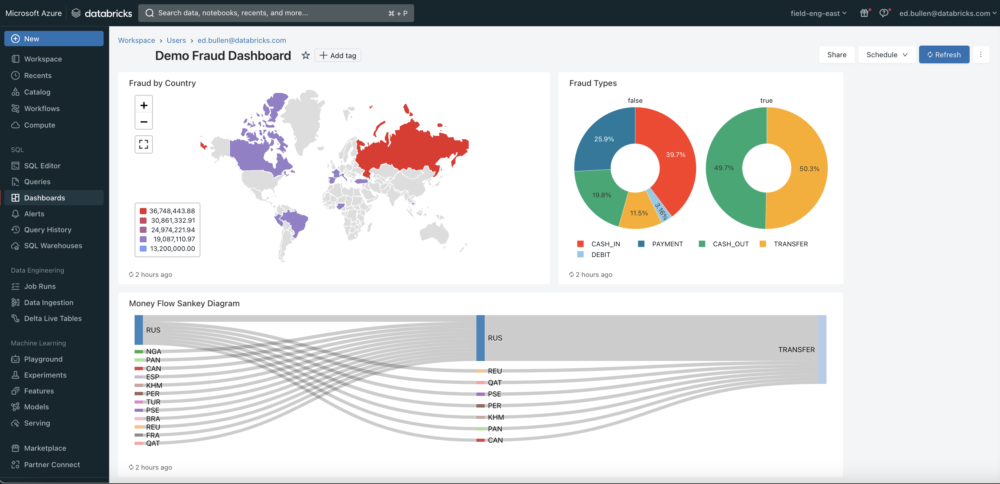
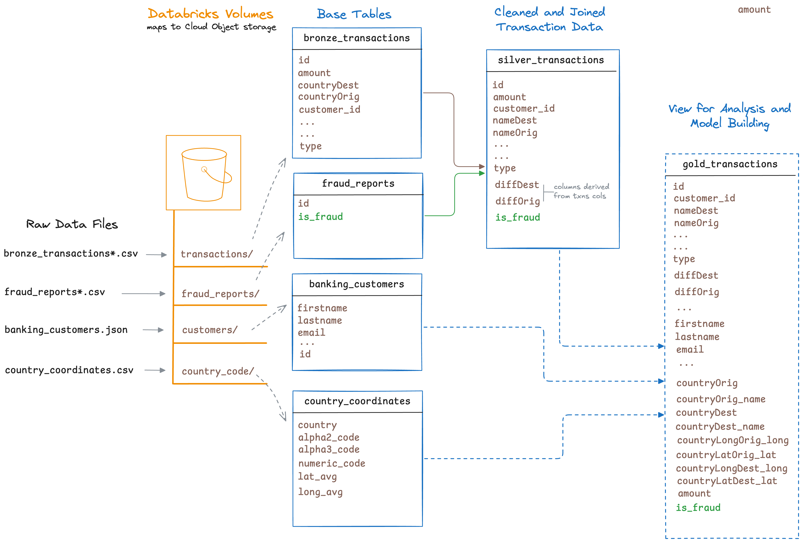

# Databricks Demo with Retail Bank Fraud Data

Ingest multiple data-sources and join them to analyze simulated bank fraud transactions and build a machine learning model to predict fraud.

The dataset is based on the [PaySim](https://www.msc-les.org/proceedings/emss/2016/EMSS2016_249.pdf),  dataset (GitHub [repo](https://github.com/EdgarLopezPhD/PaySim) and [LICENSE](https://github.com/EdgarLopezPhD/PaySim/blob/master/LICENSE) for more details). The Databricks demo version augmented this dataset to introduce simulated geo-data as well.  The Databricks version of this data has a [LICENCE](https://github.com/databricks-demos/dbdemos-dataset/blob/main/LICENSE) for use.


  

## Data Schema

Files are staged in Unity Catalog volumes and then ingested into Delta Tables.  

  

# IDE Connect to the workspace environment
Most steps described can be executed from a local IDE running with a local clone of this Git repo.   Use the Databricks SDK and CLI to authenticate to a remote workspace and it's services.
  
The Databricks CLI profiles are configured in `~/.databrickscfg`.  

+ Check the available CLI profiles to connect to: `databricks auth profiles`
+ Authenticate to a configured profile using [U2M OAuth](https://docs.databricks.com/aws/en/dev-tools/cli/authentication#oauth-user-to-machine-u2m-authentication): `databricks auth login -p my_profile_name`.  

*Either* 
+ set the DEFAULT profile to work in with the Databricks CLI by editing `~/.databrickscfg` and setting the profile name in the `[DEFAULT]` section  
*Or*  
+ Add the -p `<my_profile_name>` to the end of all Databricks CLI commands.   
in order  to make sure they get executed against the correct workspace. 

# Setup - Base Data, Tables and Views

File-based data from `./data` folder in this repo needs to be loaded to a Unity Catalog Volume.  This can be a UC *Managed Volume* (storage and setup managed within Databricks) or an *External Volume* (files stored in an external cloud storage bucket mapped to this volume).  

## Copy the CSV and JSON data to a Unity Catalog Volume
1. Identify the Databricks Catalog, Schema, Volume name to load the data to.
2. export local env vars:
+ `export UNITY_CATALOG=<catalog>`
+ `export UNITY_SCHEMA=<schema>`
+ `export UNITY_VOLUME=<volume>`

Manually, in the Workspace GUI, create the volume directory structure:
```
<volume>  
   ├── retail/
        ├── transactions/
        │── fraud_reports/ 
        ├── customers/
        ├── country_code/            
```

From the root of this repo:

```
databricks fs cp ./data/transactions/ dbfs:/Volumes/$UNITY_CATALOG/$UNITY_SCHEMA/$UNITY_VOLUME/retail/transactions/ --overwrite --recursive

databricks fs cp ./data/fraud_reports/ dbfs:/Volumes/$UNITY_CATALOG/$UNITY_SCHEMA/$UNITY_VOLUME/retail/fraud_reports/ --overwrite --recursive  

databricks fs cp ./data/customers_json/ dbfs:/Volumes/$UNITY_CATALOG/$UNITY_SCHEMA/$UNITY_VOLUME/retail/customers/ --overwrite --recursive

databricks fs cp ./data/country_coordinates/country_coordinates.csv dbfs:/Volumes/$UNITY_CATALOG/$UNITY_SCHEMA/$UNITY_VOLUME/retail/country_code/ --overwrite
```

## Create Base Tables and populate.

Before running the python scripts, make sure to set the Databricks SDK profile to work in.  EG
```
export DATABRICKS_CONFIG_PROFILE=my_profile_name
```

These tables can be setup from a remote command prompt session, running in the root of this repo.  Use the `etl/create.py` script to create the tables.

Connect to a remote workspace as per the instructions above in *IDE Connect to the workspace environment*

1. Create Bronze transactions `bronze_transactions`

+ The `create.py` script runs differently for the `bronze_transactions` table and runs an Autoloader incremental load (not a simple CTAS)

Specify the catalog `-c` the schema `-s` to work in.  
Specify the volume `-v` in which the source data is staged in.   

Example:  
```
python etl/create.py -c $UNITY_CATALOG -s $UNITY_SCHEMA -t bronze_transactions -v bank-fraud
```

2. Create the `fraud_reports`, `banking_customers`, `country_coordinates` tables

+ If the source folder name is different from the table name, specify the folder with the `-f` option.

```
python etl/create.py -c $UNITY_CATALOG -s $UNITY_SCHEMA -t fraud_reports -v bank-fraud 
```

 Note the option `--format json` for JSON format data.  

```
python etl/create.py -c $UNITY_CATALOG -s $UNITY_SCHEMA -t banking_customers -v bank-fraud -f customers --format json
```

```
python etl/create.py -c $UNITY_CATALOG -s $UNITY_SCHEMA -t country_coordinates -v bank-fraud -f country_code 
```

3. Run the Silver Transactions Merge-Load to Create the `silver_transactions` table

```
python etl/create.py -c $UNITY_CATALOG -s $UNITY_SCHEMA -t silver_transactions -v bank-fraud
``` 

4. Create the Gold Transactions View

```
python etl/create.py -c $UNITY_CATALOG -s $UNITY_SCHEMA -t gold_transactions -v bank-fraud
```

## Cleardown Base Tables and Views

1. Drop Gold Transactions View: 
```
python etl/destroy.py -c $UNITY_CATALOG -s $UNITY_SCHEMA -t gold_transactions
```  
2. Drop Silver Transactions Table: 
```
python etl/destroy.py -c $UNITY_CATALOG -s $UNITY_SCHEMA -t silver_transactions
```  
3. Drop Bronze Transactions, Fraud Reports, Banking Customers, Country Coordinates.
```
python etl/destroy.py -c $UNITY_CATALOG -s $UNITY_SCHEMA -t bronze_transactions
python etl/destroy.py -c $UNITY_CATALOG -s $UNITY_SCHEMA -t fraud_reports
python etl/destroy.py -c $UNITY_CATALOG -s $UNITY_SCHEMA -t banking_customers
python etl/destroy.py -c $UNITY_CATALOG -s $UNITY_SCHEMA -t country_coordinates
``` 

4. Delete all the files stored in Unity Catalog Volume(s)
```
databricks fs rm dbfs:/Volumes/$UNITY_CATALOG/$UNITY_SCHEMA/$UNITY_VOLUME/retail/transactions -r

databricks fs rm dbfs:/Volumes/$UNITY_CATALOG/$UNITY_SCHEMA/$UNITY_VOLUME/retail/fraud_reports -r

databricks fs rm dbfs:/Volumes/$UNITY_CATALOG/$UNITY_SCHEMA/$UNITY_VOLUME/retail/customers -r

databricks fs rm dbfs:/Volumes/$UNITY_CATALOG/$UNITY_SCHEMA/$UNITY_VOLUME/retail/country_code -r
``` 

# Setup - ML Models and AI Agents

## Machine Learning and MLflow

1. Train a model with multiple training runs in an MLflow experiment using the `./notebooks/fraud_model_training.py` notebook
 - set the Unity Catalog *Catalog* and *Schema* values where prompted in the notebook  
3. Deploy the best performing model from the MLFlow experiments to Unity Catalog using the  `./notebooks/fraud_model_deploy.py` notebook.
4. Run a batch set of predictions using the model registered in Unity Catalog and store the results using the `./notebooks/fraud_model_run.py` notebook


# Job Configuration

Use the two notebooks 
+ `./jobs/run_transaction_file_load.py`
+ `./jobs/run_silver_table_load.py`

to call the ETL code in `./etl` and run the ETL pipeline.  These read the parameters configured in the Databricks Job run-time configuration and pass them to the code execution.


