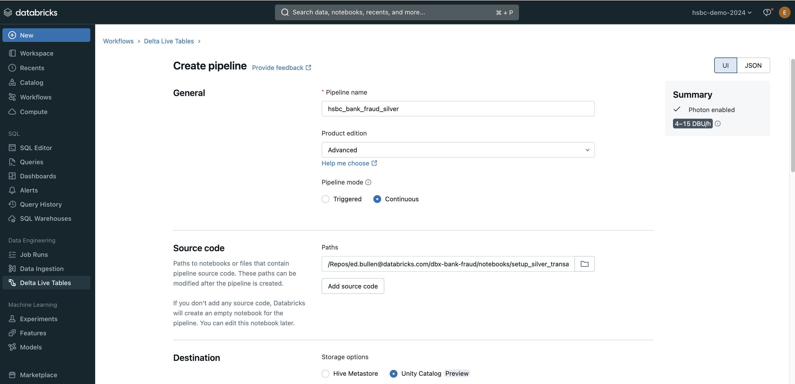
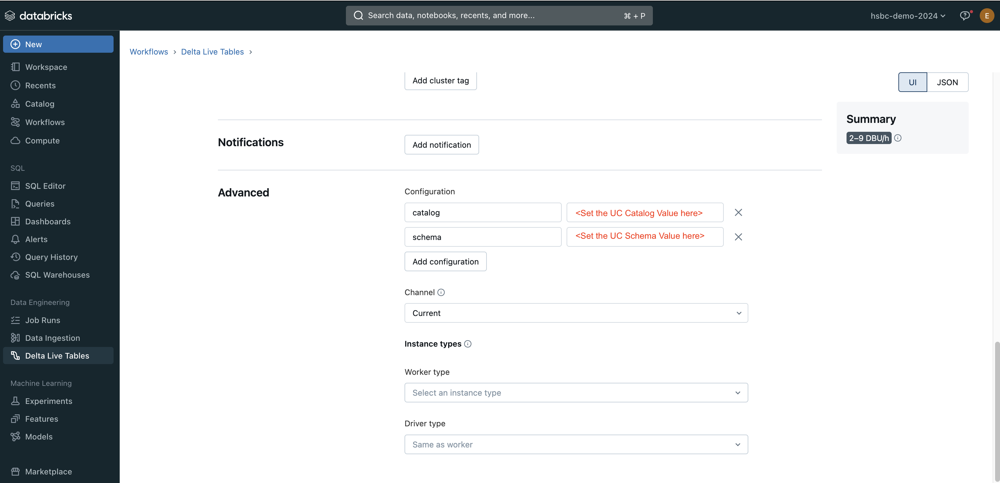

# Create DTL Pipeline

Create a pipeline to load transactions streamed in from the `transactions_raw volume` and join with `fraud_reports` Delta table.
  
The downstream Streaming table is called `silver_transactions`   

1. Create a new DLT pipleline (choose the *Delta Live Tables*) option in *Workflows*
2. Add the `setup_silver_transactions_pipeline_DLT.sql` file as the Source code for the pipeline (reference it's location in Git)
3. Set the storage destination to Unity Catalog
   

(scroll down the GUI page)

4. Select a Catalog for the UC destination
5. Select a Schema for the UC destination
6. Select any non-default Compute requirements
7. Set two parameters for the DLT pipline in the *Advanced* -> *Configuration* section:
   + Catalog
   + Schema
   
